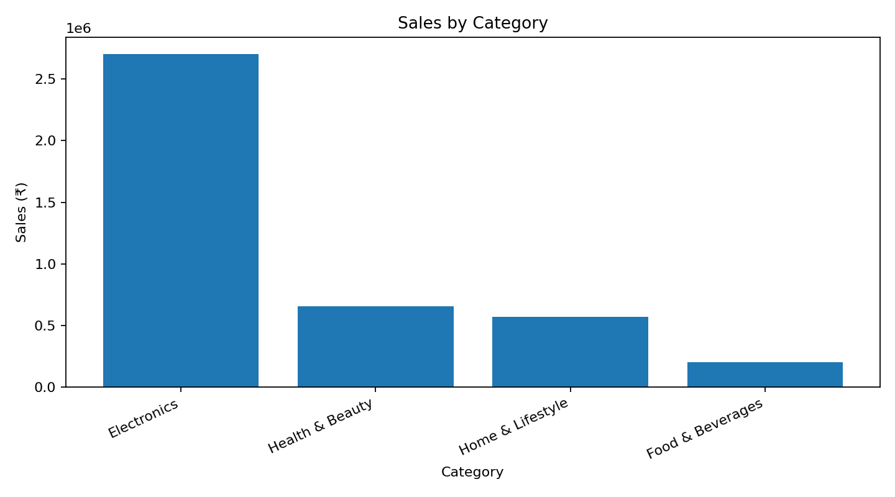
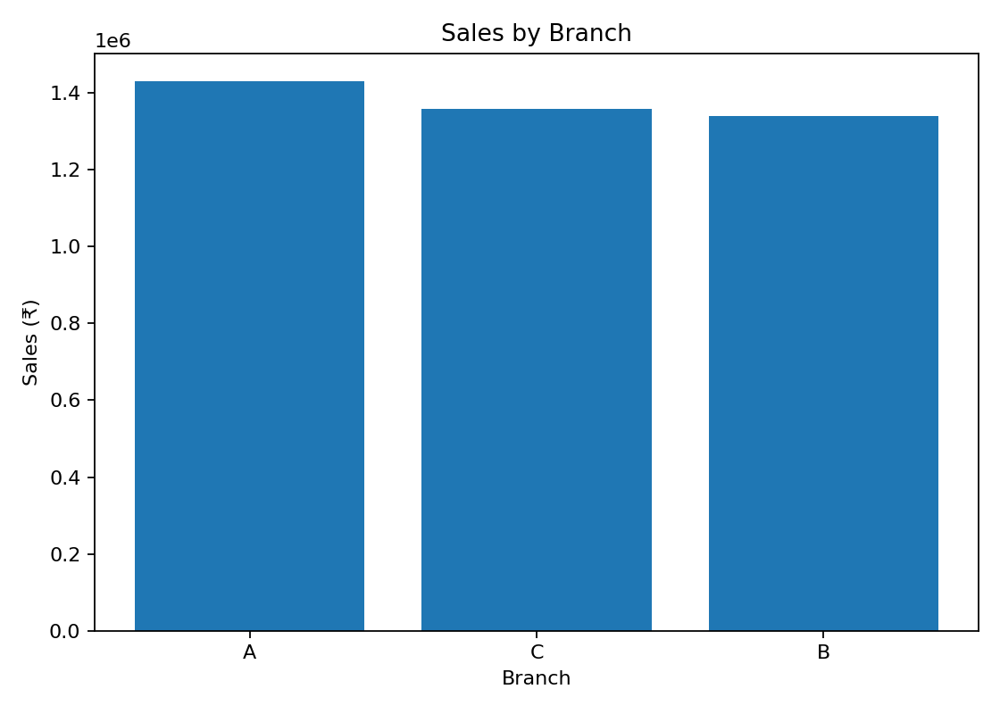
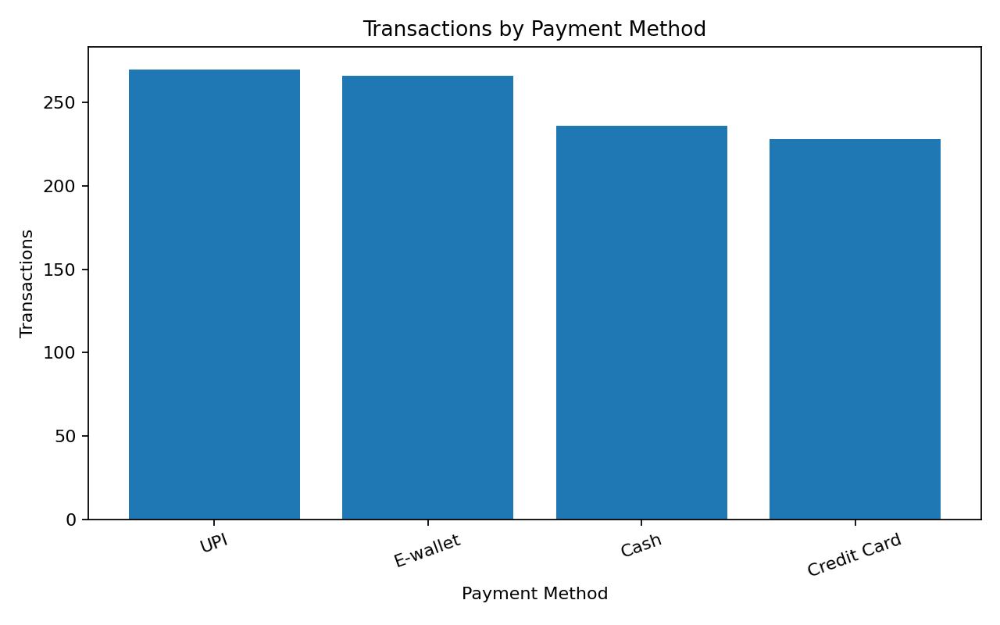

# 🛒 Supermarket Sales Data Analysis


An end-to-end **data analysis project** exploring supermarket sales, customer behavior, product performance, branch performance, payment methods, and business insights.

> **Dataset note:** This repository uses a realistic **synthetic dataset created for portfolio/learning purposes**. It is not confidential or real customer data.

## 🎯 Objectives

- Understand overall sales and profitability
- Identify high-performing product categories
- Compare branch performance
- Analyze customer and payment behavior
- Create useful business visualizations
- Demonstrate Python, Pandas and SQL analytics skills

## 🧰 Tools & Technologies

- Python
- Pandas
- NumPy
- Matplotlib
- SQL
- Jupyter Notebook
- Git & GitHub

## 📁 Project Structure

```text
supermarket-sales-data-analysis/
├── data/
│   └── supermarket_sales.csv
├── notebooks/
│   └── supermarket_analysis.ipynb
├── sql/
│   └── analysis.sql
├── visualizations/
│   ├── monthly_sales.png
│   ├── category_sales.png
│   ├── branch_sales.png
│   └── payment_transactions.png
├── analysis.py
├── requirements.txt
├── README.md
└── LICENSE
```

## 📊 Dataset

The dataset contains **1,000 transactions** covering January–June 2025.

Main columns:

| Column | Description |
|---|---|
| Invoice_ID | Unique transaction ID |
| Date | Transaction date |
| Branch | Store branch |
| City | Store city |
| Category | Product category |
| Product | Product name |
| Quantity | Units purchased |
| Unit_Price | Price per unit |
| Discount | Applied discount |
| Sales | Net sales amount |
| COGS | Cost of goods sold |
| Profit | Estimated profit |
| Payment_Method | Payment method |
| Customer_Type | Member or Normal |
| Rating | Customer rating |

## 🔍 Key Results

| KPI | Result |
|---|---:|
| Total Sales | ₹4,129,741.67 |
| Total Profit | ₹1,376,484.40 |
| Profit Margin | 33.33% |
| Transactions | 1,000 |
| Best Category by Sales | Electronics |
| Best Branch by Sales | A |
| Most Used Payment Method | UPI |

## 📈 Visualizations

### Monthly Sales Trend


### Sales by Category


### Sales by Branch


### Payment Method Usage


## 💡 Business Insights

1. **Category performance:** Electronics is the highest-revenue category in this sample.
2. **Branch performance:** Branch A generates the highest sales among the three branches.
3. **Payment behavior:** UPI is the most frequently used payment method.
4. **Profitability:** The overall estimated profit margin is **33.33%**.
5. **Decision support:** The analysis can help management compare branches, categories and customer behavior when planning inventory and promotions.

## ▶️ How to Run

### 1. Clone the repository

```bash
git clone https://github.com/MDZAID48/Supermarket-sales-data-analysis.git
cd Supermarket-sales-data-analysis
```

### 2. Install dependencies

```bash
pip install -r requirements.txt
```

### 3. Run the analysis

```bash
python analysis.py
```

### 4. Open the notebook

```bash
jupyter notebook
```

Then open:

```text
notebooks/supermarket_analysis.ipynb
```

## 📌 Future Improvements

- Build a Power BI dashboard
- Add customer segmentation
- Add sales forecasting
- Train a machine-learning model
- Connect the analysis to a SQL database
- Add automated ETL pipeline

## 👨‍💻 Author

**Mohammad Zaid Saudagar**

BCS 3rd Year | Aspiring Data Engineer

Skills: Python • SQL • Data Analysis • Machine Learning

---

⭐ If you find this project useful, consider starring the repository.
